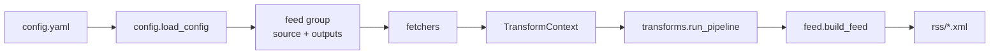

# 架构说明

## 数据流



每个 **feed group** 共享一个 `source`，只 fetch 一次；组内每个 **output** 深拷贝 entries，独立跑 transforms，各自写 XML。

## 代码结构

```
scripts/
├── generate_rss.py          # CLI：fetch → transform → write
├── config.yaml              # feed 配置（提交）；敏感凭证见 .env / Secrets
├── config.example.yaml
└── rss/
    ├── config.py            # 加载配置、解析路径
    ├── constants.py         # REPO_ROOT、RSS_OUTPUT_DIR、HTTP headers
    ├── dates.py             # parse_date、stable_date_from_entries
    ├── feed.py              # FeedGenerator 组装
    ├── fetchers/
    │   ├── html.py          # CSS 选择器解析 HTML
    │   ├── next_json.py     # Next.js _next/data JSON
    │   └── email.py         # IMAP 邮箱
    └── transforms/
        ├── base.py          # TransformContext、字段 helper
        ├── registry.py      # REGISTRY、@register
        ├── cache.py         # 转换结果文件缓存
        ├── translate.py     # type: translate
        └── __init__.py      # resolve_steps、run_pipeline
```

## config.yaml Schema

完整字段说明、示例与 transforms 参考见 **[docs/CONFIG.md](CONFIG.md)**。

此处仅保留要点：

## Transform 扩展

1. 在 `scripts/rss/transforms/` 新建 `<name>.py`
2. 实现 `Transform` 协议：`type: str` + `apply(ctx, config)`
3. 用 `@register` 装饰类
4. 在 `transforms/__init__.py` 中 `from . import <name>` 触发注册

```python
from .registry import register
from .base import Transform, TransformContext

@register
class SummarizeTransform(Transform):
    type = "summarize"

    def apply(self, ctx: TransformContext, config: dict) -> None:
        ...
```

缓存：复用 `transforms/cache.py`，key = `{type}:{config_hash}:{scope}:{field}:{content_hash}`。

## 错误与缓存

| 场景 | 行为 |
|------|------|
| fetch 失败 | 组内已有 XML 则保留并 stderr 告警；全无则 raise |
| transform 失败 | 该 output 已有 XML 则保留；否则 raise |
| 转换缓存 | `.cache/transforms/`（gitignore），原文+配置不变则跳过翻译 API |

## CI

`.github/workflows/generate-rss.yml`：定时 / 手动 / `scripts/**` push 触发 → `python scripts/generate_rss.py` → commit `rss/` 变更。

CI 通过 `actions/cache` 持久化 `.cache/transforms/`，跨 run 复用译文；key 随 `config.yaml`、transform 代码、`requirements.txt` 变化而失效。

## 相关文档

- 配置完整说明：`CONFIG.md`
- AI 入口：`../AGENTS.md`
- 从 URL 加源：`.agent/skills/rss-from-url/SKILL.md`
- 部署与用户说明：`README.md`
