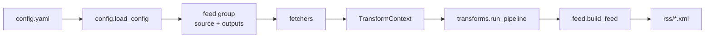

# 架构说明

## 数据流



每个 **feed group** 共享一个 `source`，只 fetch 一次；组内每个 **output** 深拷贝 entries，独立跑 transforms，各自写 XML。

## 代码结构

```
scripts/
├── generate_rss.py          # CLI：fetch → transform → write
├── config.yaml              # 本地配置（不提交）
├── config.example.yaml
└── rss/
    ├── config.py            # 加载配置、解析路径
    ├── constants.py         # REPO_ROOT、RSS_OUTPUT_DIR、HTTP headers
    ├── dates.py             # parse_date、stable_date_from_entries
    ├── feed.py              # FeedGenerator 组装
    ├── fetchers/
    │   ├── html.py          # CSS 选择器解析 HTML
    │   └── next_json.py     # Next.js _next/data JSON
    └── transforms/
        ├── base.py          # TransformContext、字段 helper
        ├── registry.py      # REGISTRY、@register
        ├── cache.py         # 转换结果文件缓存
        ├── translate.py     # type: translate
        └── __init__.py      # resolve_steps、run_pipeline
```

## config.yaml Schema

### 顶层

| 键 | 说明 |
|----|------|
| `defaults.feed` | 所有 feed 共用的 title/link/description/language 默认值 |
| `pipelines` | 命名转换管道，供 `transforms.use` 引用 |
| `feeds` | 数据源与输出列表 |

### feeds[] 每项

| 键 | 说明 |
|----|------|
| `output` | 输出文件名（有 variants 时建议 `feed.xml`） |
| `dir` | 可选；有 variants 时作为子目录名，默认取 `output` 的 stem |
| `feed` | 频道元数据（title、description、link、language） |
| `source` | 数据源配置（见下） |
| `transforms` | 可选；主输出的转换管道 |
| `variants` | 可选；同 source 的变体输出列表 |

### source 类型

**html**

```yaml
source:
  type: html
  url: "https://example.com/list"
  item_selector: "article.post"
  selectors:
    title: "h2"
    link: "a@href"
    summary: ".excerpt"      # 可选 → RSS description
    published: "time@datetime"
  verify: false              # 可选，SSL 问题时
```

**next_json**（Next.js `_next/data`，绕过 HTML 反爬）

```yaml
source:
  type: next_json
  bootstrap_url: "https://example.com/page"
  page_path: "/path/to/list"
  link_prefix: "https://example.com"
  items_key: posts           # 默认 posts
  selectors:
    title: "title"
    link: "slug"
    published: "published_at"
    summary: "excerpt|custom_excerpt"
```

选择器约定：`selector` 取文本，`selector@attr` 取属性，`a|b` 优先取第一个匹配。

### pipelines 与 transforms

**命名管道**（顶层 `pipelines`）：

```yaml
pipelines:
  to_zh:
    - type: translate
      target: zh-CN
      fields: [title, summary]
      feed_fields: [title, description]   # 仅当 feed 元数据为外文时使用
      on_error: keep
```

**引用方式**：

```yaml
transforms:
  use: to_zh                    # 引用单个 pipeline
  append:                       # 追加步骤
    - type: summarize           # 未来
      fields: [summary]
```

也支持：直接写 step 列表、`pipeline: to_zh` 步骤、`then:` 嵌套子管道。

**on_error**：`keep`（保留原文，默认）| `skip`（丢弃条目）| `fail`（抛错）

### variants 与输出路径

有 `variants` 时，同组所有 output 写入 `rss/{dir}/`：

```yaml
- dir: deeplearning-letters
  output: feed.xml
  feed: { title: "Letters from Andrew Ng", language: en }
  source: { ... }
  variants:
    - output: zh.xml
      feed:
        title: "吴恩达来信"
        language: zh-CN
      transforms:
        - type: translate
          target: zh-CN
          fields: [title, summary]
          on_error: keep
```

生成结果：

```
rss/deeplearning-letters/feed.xml   # 原文
rss/deeplearning-letters/zh.xml     # 中文版
```

无 variants 的 feed 仍输出到 `rss/<output>` 根目录。

## Transform 扩展

1. 在 `scripts/rss/transforms/` 新建 `<name>.py`
2. 实现 `Transform` 协议：`type: str` + `apply(ctx, config)`
3. 用 `@register` 装饰类
4. 在 `transforms/__init__.py` 中 `from . import <name>` 触发注册

```python
from .registry import register
from .base import Transform, TransformContext

@register
class SummarizeTransform(Transform):
    type = "summarize"

    def apply(self, ctx: TransformContext, config: dict) -> None:
        ...
```

缓存：复用 `transforms/cache.py`，key = `{type}:{config_hash}:{scope}:{field}:{content_hash}`。

## 错误与缓存

| 场景 | 行为 |
|------|------|
| fetch 失败 | 组内已有 XML 则保留并 stderr 告警；全无则 raise |
| transform 失败 | 该 output 已有 XML 则保留；否则 raise |
| 转换缓存 | `.cache/transforms/`，内容不变不重复调用翻译 API |

## CI

`.github/workflows/generate-rss.yml`：定时 / 手动 / `scripts/**` push 触发 → `python scripts/generate_rss.py` → commit `rss/` 变更。

## 相关文档

- AI 入口：`AGENTS.md`
- 从 URL 加源：`.agent/skills/rss-from-url/SKILL.md`
- 部署与用户说明：`README.md`
